# cpp_game_engine
UPLOAD NOTE:::: 9-29-2022

THIS PROJECT IS NO LONGER IN DEVELOPMENT AND HASN'T BEEN SINCE 2014

The following 'TODO' list is displayed in order for posterity and to give an overview of where the project was at...

======================================================

OLD PROGRESS SCREENSHOTS:

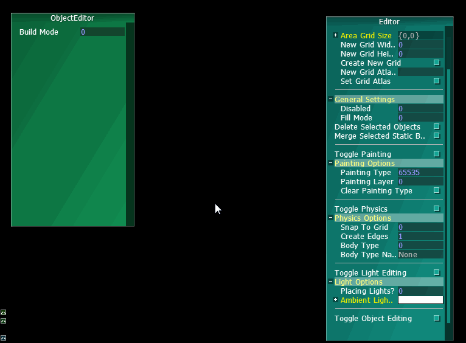
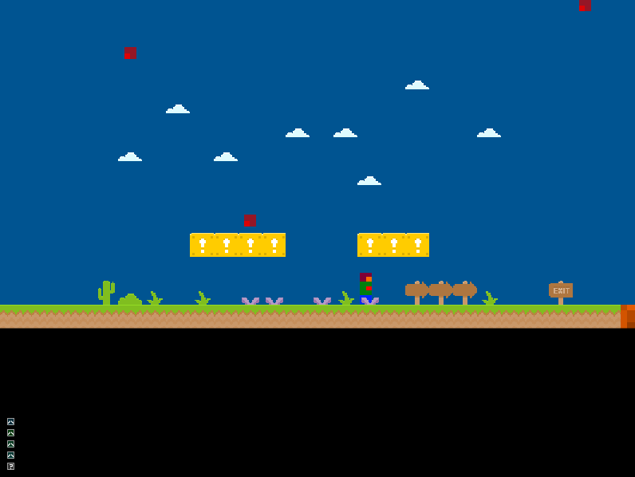
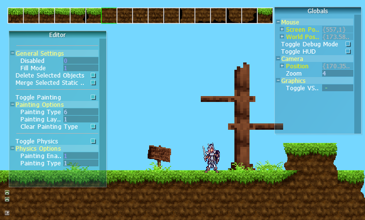
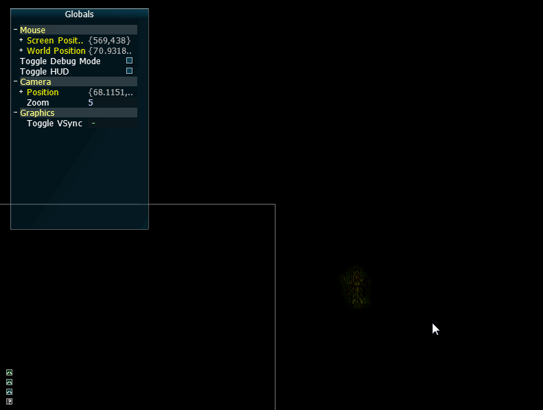
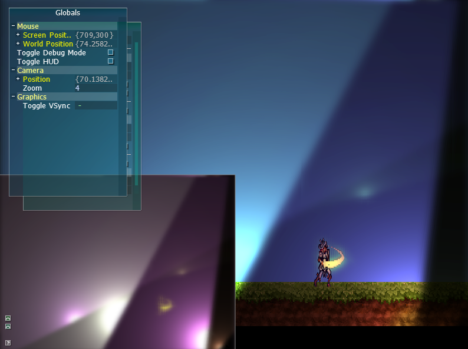
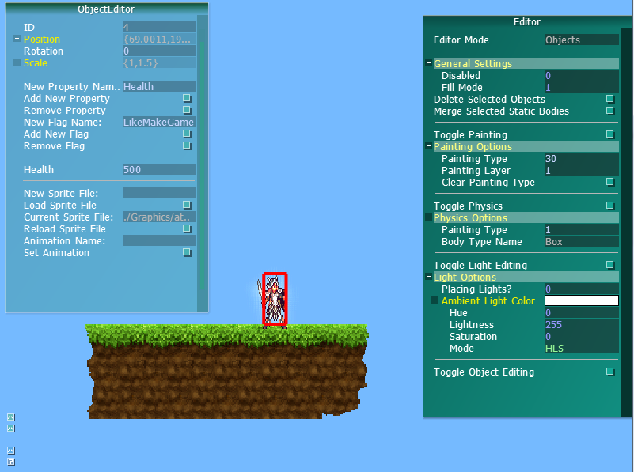
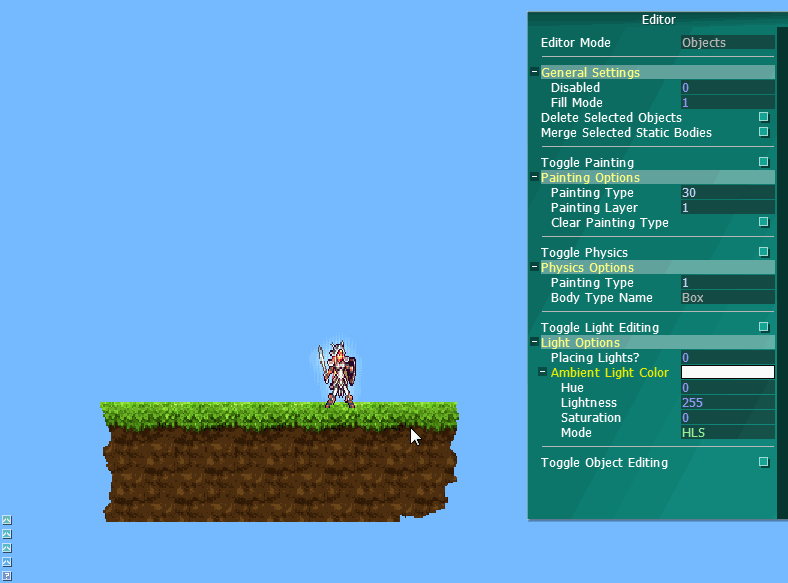
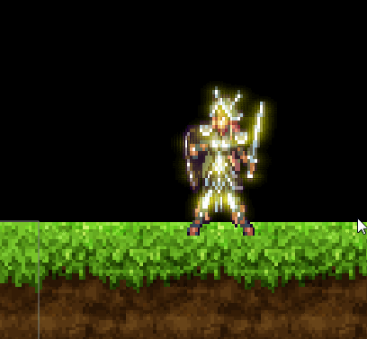
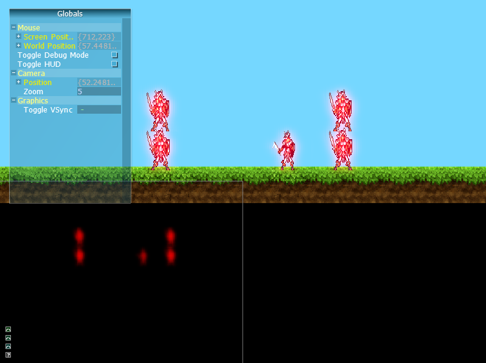
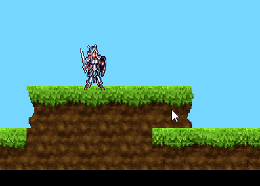
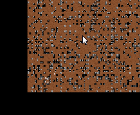

======================================================

= Things to get done =

D = Done

PD = Partially Done

= External Libraries =

  * Integrate FTGL for font rendering: - D (not used yet though)
    http://ftgl.sourceforge.net/docs/html/ftgl-tutorial.html

  * Consider writing some python bindings to enable scriptable logic. Still unsure how I want to do this. Will have to see after more features are complete and game development has begun

  * Integrate LiquidFun to replace Box2D

= Bugs & Refactoring =

 --Added March2014--

  * Fix non-area selections to allow for cycling through stacked objects (should allow this for area selections below a certain size too, ie. clicks)
  * Fix shaders for linux? (need to look into this more)
  * Fix object states so that they are 'saved' when selected and 'restored' after a selection is cleared (like gravity and such)
  * Create a state machine for the mouse to handle all the different modes/phases for the editor. Will result in much cleaner and tighter code with less bugs. Use the FSM already used for animations and logic. (This is a rather large refactor).
  * Update the Command queue system to be its own system instead of living inside GameInterface.

 --Previous/Old--

  * Revamp GUI system - PD (see blog)
  * Remove GraphicData component
  * ~~Think about implementing a chunk system for the collision grids to allow the game to remain performant on really low end computers~~ (with proper level creation the level geometry will not be a problem ever, ie. don't make a million small bodies and expect it to run fast)
  * Remove object rendering function call from ObjectManager
  * Have loaded RenderObjects (components) tracked by the RenderSystem
  * (After tweakbar is implemented) Remove level loading based on colors ( This is sort-of already done? There just isn't any replacement level loading yet... )

= New code / Updates =

 == Graphics Related ==

  * improvements for the blur

    http://prideout.net/archive/bloom/

  * Make the steps dynamic and configurable (able to add/remove pp steps)
  * Have an easy way to cause full screen filter effects (grayscale, wavy, etc)
  * Implement lights AND Implement 2D shadows (allocate a whole day for this, at least) - PD (lights mostly completed. falloff still needs work)
  * Shadows Related: define casters
  * Render paths: split lights and glow
  * Light related: fix light overlap (change texture to clamp?)
  * Implement normal maps for really snazzy textures? (wishlist feature)
  * Implement parallax scrolling textures (for large backgrounds and such)
  * Implement z-order sorting/layers for sprites
  * Maybe: move the list of render objects out of the render manager and keep them only inside areas? (Just pass a list of objects only to the renderer's render functions)

 == Editing ==
  * Save the state of all selected objects and restore it when selection leaves the objects
  * Have deleted objects remove themselves from the object tweakbar when in object mode and they are deleted
  * Create an editor interface with tweakbar - PD
  * Add functionality to extract components - PD
  * Implement Save/Load/Reload functionality
  * Create physics editor - PD
  * Create object editor - PD
  * Create trigger editor
  * Allow animation and atlas defining inside the editor
  * Create better editor controls and shortcuts
  * Keep editor input and game input separate
  * Make a enable/disable debug key for the editor/tweakbar
  * Improve the painting editor by allowing mouse selection of displayed tiles
  * Fix the 'currently selected' tile bug and improve it so that it stands out more
  * Add in more keyboard support for tile painting
  * Add in the ability to support hot key-ing favorite tiles and swapping between two tiles
  * Create a "full platform" drawing mode where all side and corner tiles are selected from an atlas and used when fill mode is used
  * Create "auto-mapping" that intelligently uses corners/edges/etc that are pre-chosen by the user
  * Create an in-editor atlas.map file generator
  * Create an in-editor .anim file editor to generate animation files easier
  * Expand edit mode screen space to allow for more space for toolbars for editing

 == Particle system ==
  * Create a particle system! (before starting, expand this TODO list)

  * Look into SPARK: http://sourceforge.net/projects/sparkengine/ (NOTE: Might not use this? Look into LiquidFun's particle system. Might use alongside for non-physics particles?)

 == Loading/Unloading ==
  * Create generic components
  * Add the ability to add/remove components
  * Load/unload objects from files? (use upgraded parser?)
  * Create a game profile to dictate how the game starts up (example: start into developer mode or load the game)

 == Audio ==
  * Create audio components? (may remove)

 == Debug == 
  * Expand debug system?
  * Auto file/IO for debug system? (debug log)
  * Overload debug system stream operators? (not really necessary)
  * Implement Debug console output (not really necessary)
  * add commands to show/hide/clear debug console ^
  * Make sure the console has a background, docking? (easy with GUI changes)

 == UI == 
  * Add an 'enter input' button to activate a popup text input box that sends commands to the console.
  * Parse console commands (check the Gedit project for how I did it before)
  * Add some commands to the console's parse list, more as needed
  * Add sprites? (or textures) to buttons and UI objects
  * Add support for bitmapped fonts
  
 == Parser ==
  * Add a few of the missing POD types to the parser
  * Create an expanded / custom serializer and writer for common engine types like glm::vec2 and b2vec2
  * Update config file parser to have categories? (Can then act more like JSON?) Think about flow more to be sure on this one. YES, going to do this for sure now... maybe. Might just use JSON, though I like my file syntax better...
  * Update the parser to get counts and other information about the contents of the file it parsed
  * Update the parser to support writing/output/data addition?

 == Input ==
  * Add functionality to track special keys (arrows etc)
  * Add functionality to track input (like for replays)
  * Add functionality to support game pads
  * Add functionality to support multiple simultaneous input sources (2+ pads for example)

 == Physics ==
  * Physics objects need filters. Add the ability to create filter groups in the editor and to add/remove objects in filter groups.
  * ~~Implement chunks for grids~~
  * ~~Implement streaming chunk loading/unloading~~
  * Implement box2d's loading jointed objects (bridges, ropes, etc)
  * Add access to box2d's ray tracing for collision and other purposes
  * Completely remove grid dependency - PD
  * Allow grid drawing to snap to both corner and center of grid tiles
  * Expand editor to allow the attaching of an arbitrary number of fixtures to one body
  * Allow the cycling through of selected fixtures when multiple AABB's overlap
  * Separate the 'picking' functions to create an independent picking set for an object that calls for one. (ie. two objects that 'pick' an area won't alter each other's returned data set)

 == Misc == 

  * Create Trigger components
  * Expand state machine objects to support substates
  * Expand state machine objects to support init/on-enter/on-exit functions

== AI ==

  * Create AI components (TODO: expand on this before starting)

----
= Wish List = 

  * Move some things onto their own threads and think about adding SFML's thread support.
  * Add networking from SFML to have multiplayer support

----
= Think about =

  * Level Tile grids - Want: multilayer tile areas, atlas'd areas (create atlas at runtime after loading each tile texture, or group of tiled textures), dynamic bounds creation/removal - DONE. CAN DO THIS NOW!
  * Level formats - Want: grid data, object data, trigger data, state data - Grid, object, state, DONE. Think about triggers...
  * Level editing - Will be editable at runtime (tweakbar.), map edit mode, Object edit mode (object creator?), trigger edit mode. Able to load,save,reload as needed. (next feature, wishlist?) Make checkpoints for fast reloading after editing? Have an edit-test mode where state is saved before edit-test is enabled and loaded after ending.

{{{
Flow:
  Objects are made through the object creator mode
  Object creator mode will use a special dev level to test features
  Created object types are available in a list in tweakbar
  Created object types are stored in a folder for created objects

  Trigger types are made in a text file
  Triggers are objects that have trigger logic and commands inside them
  Triggers exist on a per-level basis

  Level layouts are made through the level edit mode
  Use tweakbar to choose and paint textures
  Use tweakbar edit mode to paint tile collision data
  Use tweakbar w/ edit mode to create special collision edges as desired
}}}

----
= COMPLETED = 
Just a sort-of list where I can put completed stuff...

  * Move GraphicsData stuff into the RenderSystem - D
  * Remove GraphicsData component - D
  * Test code with profiler, fix slowdown - D, Note: Result of physics. Look into optimizations
  * Test texture loading with simple .bmp loading (not using shaders) - D
  * Track loaded textures - D
  * Get ~~boost libraries~~ stb_lib for loading .gif, .png, ~~.tiff,~~ .jpg, ~~.tga~~ loading - D
  * Make textures load with each extension - D
  * Implement texture atlas loading for grids - D 
  * Make textures render with shaders - D
  * Add viewport culling for objects - D
  * Create a Screen-to-World transform function - D
  * Add texture pointer to RenderObject - D
  * Implement collision grid optimizing by merging points - D
  * Create sprite animation controller components for renderable - D
  * Add the ability to have 'textured quads' ~~or 'generic shapes' with texture coordinates, allow both~~ to be animated, ~~may have to have a frame specification struct or something~~ (SpriteAnimation struct)- D
  * Improve physics debug drawing - D
  * Create audio system ~~(use SDL's audio stuff)~~ using SFML - D
  * Integrate tweakbar - D
  * Create a state machine class for use in the engine - D
  
  * implement a blur shader like this article: - D

    http://xissburg.com/faster-gaussian-blur-in-glsl/
  
  * Make content render through post processing steps (render to full screen quad) - D
  * Make sure the PP (post processing) steps handle screen resizing - D
  * Add the ability to make objects or textures glow - D
  * Test post processing glow steps with animation - D
  * Add functionality to "select" game objects - D
  * update the UI system to keep track of UI objects in a z-ordered tree - D
  * have the UI system keep track of which objects are "in front" - D
  * automatically switch rendering order of UI objects based on positions in tree, or, which is "in front" - D
  * Implement an input UI box - D
